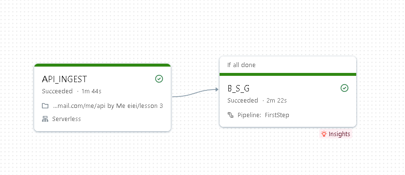
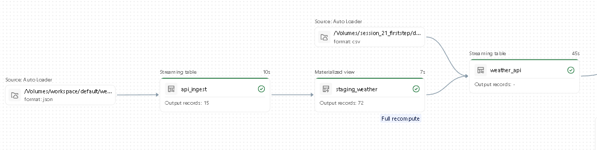
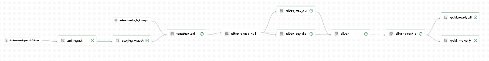
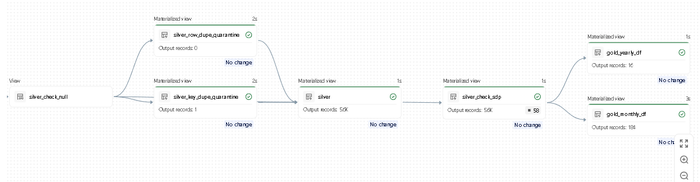
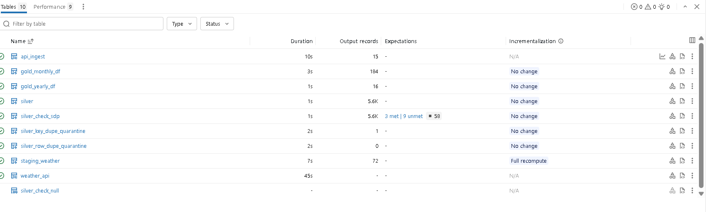

# SDP-AUTOLOADER-API

## 1. Overview

This project uses historical weather data from the Open-Meteo Archive API to
demonstrate how Databricks Auto Loader incrementally ingests newly landed files.
The API notebook fetches daily observations for Bangkok, Tokyo, and London and
writes JSON files to a Unity Catalog Volume, where Auto Loader discovers and
ingests them into the downstream weather pipeline.

**Project focus:** API ingestion, checkpoint-based resumption, Auto Loader,
weather-data validation, and daily/monthly/yearly analytics.

## 2. Architecture

**Job workflow**



**Auto Loader ingestion**



**Lakeflow pipeline**



**Silver and Gold processing**



**Pipeline tables**



The pipeline uses a medallion-style flow:

```text
CSV files → CSV Auto Loader (separate flow)

Open-Meteo API → Daily JSON files → JSON Auto Loader → Staging → Silver → Gold
```

The repository defines separate CSV and JSON Auto Loader flows. The JSON flow
ingests the weather API files and feeds the weather transformations; the CSV
flow is defined separately in `src/src/Bronze_setup.py`.

The API notebook requests up to `days_per_run` days per run, ending no later
than yesterday. It resumes from its checkpoint after successful dates. For each
date, all three city requests must succeed before a JSON file is written and the
checkpoint advances.

## 3. Key Features

- Retrieves daily historical weather from Open-Meteo with request retries and
  exponential backoff.
- Lands one newline-delimited JSON file per date and records progress in a
  checkpoint file.
- Ingests landing JSON with Databricks Auto Loader and captures file and load
  metadata.
- Defines staging transformations, Silver validation and duplicate quarantine,
  and yearly/monthly aggregate views.
- Provides `dev` and `prod` Databricks Asset Bundle targets.

## 4. Data Pipeline Workflow

| Task / Flow | Definition | Dependency | Description |
| --- | --- | --- | --- |
| `API_INGEST` | `src/api_ingest.py` | None | Fetches daily weather, writes landing JSON, and updates the checkpoint. |
| `B_S_G` | Lakeflow pipeline task in `resources/SDP.yml` | `API_INGEST` (`ALL_DONE`) | Runs the configured pipeline, whose notebooks define Auto Loader and downstream table logic. |
| Bronze JSON ingestion | `src/src/Bronze_api_ingest.py` | Pipeline flow | Reads landing JSON with Auto Loader into `api_ingest`. |
| Weather staging | `src/src/staging_weather.py` | Bronze JSON data | Parses daily values, filters the three configured cities, and produces daily rows. |
| Silver | `src/src/silver.py` | Staged weather data | Applies expectations and duplicate handling to produce Silver data. |
| Gold | `src/src/Gold.py` | `silver_check_sdp` | Defines yearly and monthly city-level weather aggregate views. |

The bundle refers to an existing Lakeflow pipeline by ID; that pipeline is not
declared in this repository's job resource.

## 5. Project Structure

```text
.
├── .github/workflows/pipeline.yml  # Tests, bundle validation, and deployment
├── databricks.yml                 # Asset Bundle targets and workspace settings
├── resources/SDP.yml              # Job tasks and referenced pipeline ID
├── src/
│   ├── api_ingest.py              # API fetch, landing files, and checkpoint
│   ├── ddl.py                     # Catalog/Volume setup helper
│   └── src/
│       ├── Bronze_api_ingest.py   # JSON Auto Loader flow
│       ├── staging_weather.py    # Daily weather row transformation
│       ├── silver.py             # Validation and duplicate handling
│       ├── Gold.py               # Yearly and monthly aggregate views
│       └── Bronze_setup.py       # Separate CSV Auto Loader flow
├── test/test_bronze.py            # Local Spark transformation tests
└── requirements.txt              # PySpark and pytest
```

## 6. Configuration

The Asset Bundle defines `dev` and `prod` targets. Their catalog variable is set
to `dev` or `prod`, but pipeline notebook table names are hard-coded to
`session_21_firststep.default`. Workspace host and bundle root path are also
configured in `databricks.yml` and should be reviewed for the target workspace.

The API notebook exposes these Databricks widgets:

| Setting | Default | Description |
| --- | --- | --- |
| `start_date` | `2025-04-05` | Starting date if there is no valid checkpoint. |
| `days_per_run` | `5` | Maximum dates processed in one run; must be positive. |

The notebook uses the fixed landing path
`/Volumes/workspace/default/weather_landing/weather_data`. Create the Volume
and grant the job identity the required write access. The separate helper
`src/ddl.py` creates `session_21_firststep.default.fistproject2` and does not
provision the API landing Volume.

The three cities and their coordinates/time zones, the Open-Meteo endpoint,
and the requested daily variables are currently defined directly in
`src/api_ingest.py`.

## 7. Technologies

- Databricks Jobs and Lakeflow Declarative Pipelines
- Databricks Asset Bundles
- PySpark and Python
- Unity Catalog Volumes and Delta-backed pipeline tables
- Databricks Auto Loader
- GitHub Actions and pytest

## 8. How to Run

### Prerequisites

- A Databricks workspace with permission to deploy bundles and run the job.
- Databricks CLI with Asset Bundles support and workspace authentication.
- The referenced Lakeflow pipeline must exist in the workspace.
- The configured landing Volume must exist and be writable by the job identity.
- For local tests, Python 3.10 and Java 11 (the versions used by CI).

### 1. Clone and authenticate

```bash
git clone <repository-url>
cd SDP-AUTOLOADER-API
databricks auth login
```

### 2. Configure and deploy

In `databricks.yml`, replace the email in `root_path` with your Databricks
login email and update the `workspace.host` URL for both `dev` and `prod` to
your workspace host. Ensure the pipeline ID in `resources/SDP.yml` refers to
the intended workspace's pipeline.

```bash
databricks bundle validate -t dev
databricks bundle deploy -t dev
```

For production, replace `dev` with `prod`.

### 3. Initialize the catalog and Volume

Run `src/ddl.py` as a notebook in the Databricks workspace to create its
catalog and Volume. This helper creates
`session_21_firststep.default.fistproject2`; the API ingestion notebook writes
to `/Volumes/workspace/default/weather_landing/weather_data`, which must also
exist and be writable by the job identity.

### 4. Run the job

```bash
databricks bundle run -t dev SDP_API_AUTOLOADER
```

The job can also be started from the Databricks Workflows UI. Set `start_date`
and `days_per_run` through the notebook task parameters when needed.

## 9. Data Quality / Validation

The pipeline notebooks define validation for expected cities, date format,
required weather fields, temperature bounds, and non-negative precipitation
and rain. Silver also defines duplicate quarantine views. The checks use
Lakeflow expectations and transformations; this repository does not configure
a separate data-quality reporting or alerting service.

## 10. Example Outputs

The Gold notebook defines these aggregate views from `silver_check_sdp`:

| View | Grouping | Example metrics |
| --- | --- | --- |
| `gold_yearly_df` | City and year | Days recorded, average/high/low temperature, precipitation, rainy days, and wind metrics. |
| `gold_monthly_df` | City, year, and month | The yearly metrics plus temperature and precipitation ranks. |

## 11. Known Limitations

The pipeline runs normally in my workspace. Deploying to a different workspace
may require granting the job identity access to the landing Volume and
permission to run the Lakeflow pipeline.

## 12. Author

**GitHub:** [@papungkorn2548](https://github.com/papungkorn2548)
